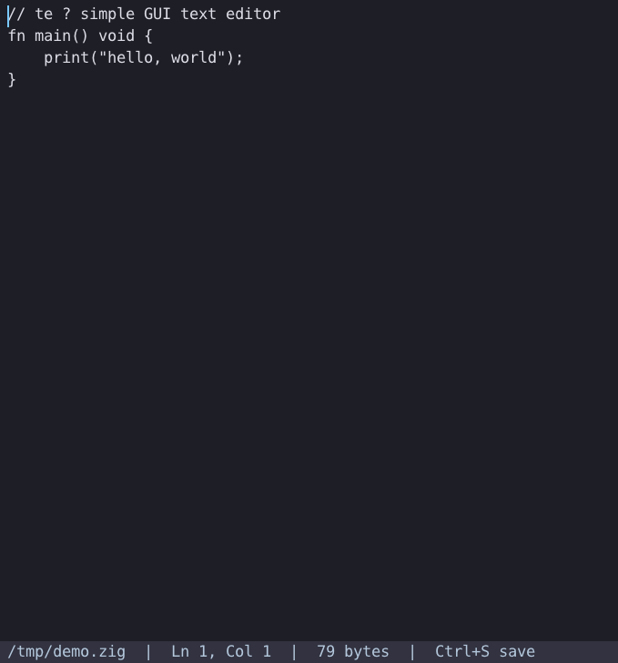

# te — a simple GUI text editor in Zig + raylib

A minimal cross-platform GUI text editor for **Linux, macOS, and Windows**.
Single window, monospace font, load/edit/save a plain-text file. Built with
[raylib](https://www.raylib.com/) (fetched by the Zig package manager) and Zig.
The font is embedded in the binary, so it looks identical everywhere with no
runtime assets.



## Controls

| Key / Mouse | Action |
| --- | --- |
| Type / Enter / Tab | Insert text (Tab = 4 spaces) |
| Backspace / Delete | Delete selection, or char before / at cursor |
| Arrows, Home, End  | Move the cursor |
| PageUp / PageDown  | Move a screen up / down |
| Shift + any move   | Extend the selection |
| Click / drag       | Place caret / select |
| Mouse wheel        | Scroll |
| Ctrl+A             | Select all |
| Ctrl+C / X / V     | Copy / cut / paste |
| Ctrl+Z / Y         | Undo / redo |
| Ctrl+S             | Save (prompts for a name if the buffer is unnamed) |
| Ctrl+W             | Save as… (minibuffer) |
| Ctrl+O             | Open file (minibuffer) |
| Ctrl+F             | Search (Enter to find; Ctrl+F then Enter repeats) |
| Esc / Ctrl+G       | Cancel the minibuffer |
| Ctrl+Q / close window | Quit (asks y/n/c in the minibuffer if unsaved) |

There's an **Emacs-style minibuffer** on the bottom line: file open/save-as,
search, the quit confirmation, and transient echo messages (e.g. "Saved",
"Failing search") all happen there. Long lines scroll horizontally; line
numbers show in the gutter; the cursor blinks.

Open a file by passing it on the command line; it is created on first save if
it does not exist:

```sh
zig build           # produces ./te in the project root
./te notes.txt      # or: ./te   (defaults to untitled.txt)
```

## Dependencies

`build.zig` selects the right GLFW backend and system libraries per OS:

- **Linux** — X11/OpenGL. Install the dev packages (raylib's GLFW needs the
  headers + `.so`s):
  ```sh
  sudo apt install \
    libgl-dev libx11-dev libxrandr-dev libxinerama-dev \
    libxcursor-dev libxi-dev libxext-dev libxrender-dev libxfixes-dev
  ```
  (Other distros: the equivalent `mesa`/`libX11` `-devel` packages.)
- **macOS** — links the Cocoa/IOKit/OpenGL frameworks; needs the Xcode command
  line tools (`xcode-select --install`). `rglfw.c` is compiled as Objective-C.
- **Windows** — links `gdi32`/`winmm`/`opengl32`/`user32`/`shell32`; no extra
  install beyond the Zig toolchain.

## Building

```sh
zig build           # Linux/macOS: ./te   •   Windows: ./te.exe   (no zig-out/)
zig build run       # build and run
```

Cross-compile with the standard Zig flag, e.g.:

```sh
zig build -Dtarget=x86_64-windows
zig build -Dtarget=aarch64-macos
```

## How it works

- `src/main.zig` — the editor itself: a flat 1 MiB text buffer with a caret and
  selection anchor, all edits funnelled through one `edit()` primitive that
  feeds operation-based undo/redo (with typing coalesced into one step),
  clipboard via raylib, mouse hit-testing, vertical + horizontal scrolling, and
  rendering (gutter line numbers, selection highlight, blinking caret, status
  bar, unsaved-changes dialog).
- `src/config.zig` — all the tunables (window size, font size, colors, tab,
  buffer capacity) in one place.
- `src/binding.zig` — the key → action map; edit the `bindings` table to rebind.
- `main` takes a `std.process.Init`, so file I/O goes through the Zig standard
  IO layer (`std.Io.Dir.readFileAlloc` / `writeFile` with the runtime-provided
  `io`), and the optional filename argument comes from `init.minimal.args`.
- The monospace font (`src/font.ttf`, Roboto Mono Regular) is embedded with
  `@embedFile` and loaded via `LoadFontFromMemory` — no font files at runtime.
- `build.zig.zon` declares the raylib dependency; `zig build` fetches it.
- `build.zig` compiles raylib's C sources (`rcore`, `rglfw`, `rshapes`,
  `rtextures`, `rtext`) for the OpenGL-3.3 desktop backend, picking the X11 /
  Cocoa / Win32 GLFW backend and system libraries from the target OS. It
  translates `raylib.h` into Zig bindings via `addTranslateC` and copies the
  built binary into the project root as `./te` (`./te.exe` on Windows).
  (It compiles raylib's source directly rather than calling raylib's own
  `build.zig`, which targets stable Zig and doesn't build under this nightly.)

## License

This project is licensed under the [MIT License](LICENSE).

Third-party components keep their own licenses:

- **raylib** (fetched via `build.zig.zon`) — zlib/libpng license.
- **Roboto Mono** (`src/font.ttf`) — Apache License 2.0.
