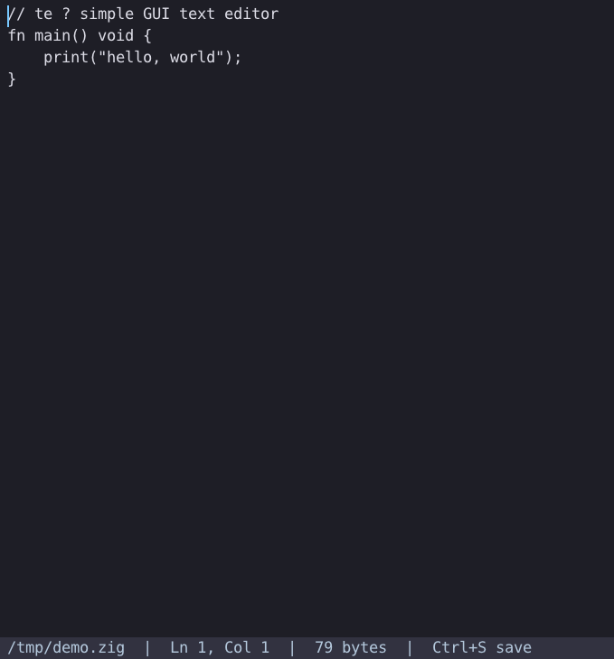

# te — a simple GUI text editor in C + GLFW

A minimal GUI text editor, built and tested on **Linux only**. Single window,
monospace grid, load/edit/save a plain-text file. Built with
[GLFW](https://www.glfw.org/) (windowing/input) + OpenGL 1.1 (rendering),
PCRE2, FreeType2 (font rasterization), and libpng (screenshot PNG output) —
all linked from the system install, found via pkg-config — plus a small
from-scratch Prolog engine for scripting, using a plain GNU Makefile as the
build system.

Text is rendered with **[UnifontEX](https://github.com/stgiga/UnifontEX)** — a
single font covering every Unicode plane — so Latin, Greek, Cyrillic, CJK,
symbols, and (monochrome) emoji all display out of the box. `UnifontExMono.ttf`
is bundled in the repo and loaded from disk at startup.



## Controls

Emacs-flavored. The **leader** is a **double-tap of Ctrl**; a **triple-tap**
jumps straight to the command prompt. Every action you run is echoed on the
bottom line (e.g. `move left x3`).

**Movement** (Emacs-style; the plain arrow/Home/End/PageUp keys are off by
default — re-enable them in `src/binding.h`)

| Key | Action |
| --- | --- |
| Ctrl+B / F / P / N | Left / right / up / down |
| Ctrl+Shift+A / E | Line start / end |
| Ctrl+W / Ctrl+Shift+W | Next / previous word |
| Ctrl+D | End of word |
| Ctrl+J / Ctrl+Shift+J | Screen up / down |
| Ctrl+`<digit>` | Repeat the next action **or typed character** N times (`Ctrl+3` `w` → `www`) |

**Selection & clipboard**

| Key | Action |
| --- | --- |
| Shift + any move | Extend the selection |
| Ctrl+Space | Toggle the mark — then movement selects |
| Ctrl+C / X / V | Copy / cut / paste |
| Leader then A | Select all · Leader then Space: select line |
| Click / drag | Place caret / select |

**Editing & lines**

| Key | Action |
| --- | --- |
| Type / Enter / Tab | Insert text (Tab = 4 spaces) |
| Ctrl+Enter / Ctrl+Shift+Enter | Open a blank line below / above |
| Backspace / Delete | Delete before / at caret (or selection) |
| Ctrl+Backspace | Delete forward |
| Ctrl+Z / Ctrl+Shift+Z | Undo / redo |
| Ctrl+Shift+X / C / V | Cut / copy / paste the **whole line** |
| Ctrl+Shift+F / B | Shift line left / right one space (out/indent) |
| Ctrl+Shift+N / P | Move the whole line down / up |

**Files, search & commands**

| Key | Action |
| --- | --- |
| Ctrl+S / Ctrl+Shift+S | Incremental search / regex search (Perl/PCRE) |
| Ctrl+R / Ctrl+Shift+R | Query-replace / regex query-replace |
| Leader then S / W / O | Save / save-as / open (minibuffer) |
| Leader then a name + Enter | Run a named command |
| Leader then H / N | Commands help · key help |
| Esc / Ctrl+G | Cancel minibuffer / clear selection & mark |
| Ctrl+Q / close window | Quit (asks y/n/c if unsaved) |

**Search:** `Ctrl+S` (literal) or `Ctrl+Shift+S` (regex) opens the search
prompt. It jumps to the nearest match as you type and shows `Match X/N` in the
echo area; **`Ctrl+N` / `Ctrl+P`** step to the next / previous match. `Enter`
keeps the current match, `Esc`/`Ctrl+G` returns to where you started, and an
empty query + `Enter` repeats the last search. Regex is full **Perl/PCRE**
syntax (`\d \w \s \b`, `(?:…)`, lookaround, `*?`, backreferences, `(?i)`, …) —
the same dialect as `grep -P`, not POSIX BRE/ERE.

**Replace** (`Ctrl+R` / `Ctrl+Shift+R`, or the `replace` / `replace-regex`
commands) prompts for a pattern then a replacement and runs an **interactive
query-replace**: like search it highlights matches with `Ctrl+N`/`Ctrl+P` to move
between them, but `Enter` replaces the current match and advances, staying in
replace mode until `Esc`. `replace-all` / `replace-all-regex` substitute
**every** match at once (one undo step). In the regex variants the replacement
may use `$1`, `$0`, etc. `search-reverse` / `search-regex-reverse` (command-only)
search toward the top of the file.

Named commands (leader, then type the name): `save`, `save-as`, `open`,
`search`, `search-regex`, `search-reverse`, `search-regex-reverse`, `replace`,
`replace-regex`, `replace-all`, `replace-all-regex`, `undo`, `redo`, `copy`,
`cut`, `paste`, `select-all`, `toggle-wrap`, `quit`. (Each name is the action's
own tag, so they can't drift.)

There's an **Emacs-style minibuffer** on the bottom line: file open/save-as,
search, the quit confirmation, and transient echo messages all happen there.
Soft wrap is on by default (toggle with the `wrap` command); line numbers show
in the gutter; the caret blinks. **Saving resets the undo history**, and undoing
all the way back marks the file untouched again.

Open a file by passing it on the command line; it is created on first save if it
does not exist. `--regex <pattern> [file] [out]` is a **headless grep** — it
reads `file` (or **stdin** if omitted), writes each matching line (`lineno:text`)
to `out` (or **stdout**), and exits without a window (exit 0 if any matched, 1 if
none, 2 on error), so it pipes like `grep -P`. `--screenshot <frames> <path>`
renders that many frames, writes a PNG, and exits.

```sh
make -j$(nproc)                    # produces ./te in the project root
./te notes.txt                     # or: ./te   (defaults to untitled.txt)
./te --regex 'foo\d+' notes.txt    # headless: print matching lines, then exit
cat notes.txt | ./te --regex '\bTODO\b'      # read stdin
./te --regex 'foo\d+' notes.txt hits.txt     # write results to hits.txt
./te notes.txt --screenshot 10 out.png
```

## Scripting

`te` loads an optional Prolog init script at startup —
`$XDG_CONFIG_HOME/te/init.pl`, falling back to `~/.config/te/init.pl` —
the way Emacs loads `.emacs` or Vim loads `init.vim` — **followed by te's
own `src/default_bindings.pl`**, read from disk next to the executable (see
"How it works" below). A missing init.pl is fine (te just uses its built-in
defaults); a script error is echoed on the status line instead of stopping
`te` from starting. See `docs/init.pl.example` for a starting point.

Bindings, hooks, and commands are plain **facts and rules** — not just for
`init.pl`, `te`'s own defaults are facts too (`src/default_bindings.pl`),
re-checked fresh every time they're needed rather than registered once as
an opaque callback, so a clause can be a rule whose body consults live
editor state, not just a fixed action. Since `init.pl` loads *before* the
built-in defaults, a user fact at the same key/mod/name is tried first and
wins — clauses are tried in assertion order, first match runs:

| Predicate | Does |
| --- | --- |
| `key_binding(Key, Mod, Handler)` | Bind a top-level key to any goal, or an existing action via `te_action(Name)`. Fires while held (auto-repeat) |
| `key_binding_once(Key, Mod, Handler)` | Same, but fires once per press, not on auto-repeat — for things like copy/cut/paste, search, quit |
| `leader_binding(Key, Mod, Handler)` | Same idea as a leader chord (after the double-Ctrl-tap leader); never auto-repeats regardless |
| `command(Name, Handler)` | Bind `Name` as a command typeable at the leader/triple-tap-Ctrl prompt |
| `hook(Event, Handler)` | Run `Handler` whenever `Event` fires: `post_save` or `post_open` |
| `te_action(Name)` | Run a named command (anything in `COMMANDS`, `src/binding.h` — every action has a name, not just the ones typeable as a command) |
| `te_echo(Msg)` | Write a message to the status line |
| `te_insert(Text)` | Insert text at the cursor (or replace the selection) — goes through the same path as typing, so undo/redo work |
| `te_text(Text)` | Unify `Text` with the whole buffer, as a list of character codes |
| `te_cursor(Pos)` / `te_set_cursor(Pos)` | Get/set the cursor as a byte offset |

`Key` is a single-character atom (`g`, `3`) or one of `space`, `enter`,
`kp_enter`, `tab`, `backspace`, `delete`, `escape`. `Mod` is `any`, `ctrl`,
or `ctrl_shift` (underscore, not hyphen — a bare Prolog atom can't hold
one). `Handler` is any goal — a custom predicate, or a direct
`te_action(Name)` call (action names like `"select-all"` have a hyphen, so
pass them as a quoted `"..."` rather than bare — see below, it works as
either an atom or text argument). Modal (command) mode restricts a bare key
to navigation: a `te_action(Name)`-shaped handler where `Name` is a
navigation action still fires, anything else (including any custom
handler predicate — there's no general way to tell whether an arbitrary
goal "is navigation") is blocked, same as it always was for a non-nav
built-in. An uncaught error inside a handler is echoed rather than
crashing `te`.

The engine (`src/prolog.h`/`prolog.c`) is a small **from-scratch, ISO-flavored
Prolog**, not a wrapper around an external library: facts/rules, unification,
backtracking, cut (`!`), if-then-else, arithmetic, structured ISO error terms
(`error(type_error(...), _)`, `instantiation_error`, `existence_error/2`, …,
all catchable by shape via `catch/3`), standard order of terms (`compare/3`,
`@</2`, `@=</2`, `@>/2`, `@>=/2`), type-checking predicates (`var/1`,
`nonvar/1`, `atom/1`, `atomic/1`, `number/1`, `integer/1`, `float/1`,
`compound/1`, `callable/1`, `is_list/1`, `ground/1`), `assert`/`retract`,
`findall/3`, `functor/3`, `=../2`, `arg/3`, `copy_term/2`, `sort/2`/`msort/2`,
`atom_codes/2`/`atom_chars/2`/`char_code/2`/`number_codes/2`/`number_chars/2`,
and a practical-subset parser with a fixed infix operator table (no
user-defined `op/3`). Per ISO, `"..."` is a proper list of character codes,
not its own string type — `te_text/1` and friends accept either an atom or a
code list for text arguments, so `"..."` literals still read naturally in
scripts. "Codes" are raw bytes (0–255), not Unicode codepoints, matching
`te`'s raw-UTF-8 buffer.

A list/control-predicate library — `member/2`, `memberchk/2`, `append/3`,
`reverse/2`, `last/2`, `nth0/3`/`nth1/3`, `sum_list/2`, `max_list/2`/
`min_list/2`, `numlist/3`, `maplist/2-4`, `forall/2`, `include/3`/`exclude/3`,
`foldl/4`, `delete/3`, `subtract/3`/`intersection/3`/`union/3`, `between/3`,
`succ/2` — lives in `src/bootstrap.pl`, real Prolog source consulted at
startup rather than hand-coded in C: most of them don't need anything a
native function can do that a recursive clause can't, so the engine
dogfeeds its own unification/backtracking instead of duplicating that
logic. Read from disk at startup next to the running executable, the same
way the bundled font is (see "How it works" below) — a missing
`src/bootstrap.pl` is treated as fatal, the same as a missing font, since
it's core engine behavior everything else leans on, not user-swappable
content. ISO-flavored, not a certified conformance suite.

## Dependencies

Linux. Install:

- **GLFW3** (`libglfw3-dev`), **OpenGL** (`libgl1-mesa-dev` or your driver's
  GL dev package), **libpcre2-8** (`libpcre2-dev`), **FreeType2**
  (`libfreetype-dev`), and **libpng** (`libpng-dev`), discovered via
  **pkg-config** (`glfw3.pc`/`gl.pc`/`libpcre2-8.pc`/`freetype2.pc`/
  `libpng.pc` — your distro's dev packages, e.g. on Debian/Ubuntu:
  `sudo apt install libglfw3-dev libgl1-mesa-dev libpcre2-dev
  libfreetype-dev libpng-dev`). If pkg-config can't find one, point
  `PKG_CONFIG_PATH` at the directory holding its `.pc` file. The Makefile
  calls `pkg-config --cflags/--libs` directly — no wrapper or generator step.
  GLFW is deliberately used only for windowing/input/context creation, not
  rendering: all drawing goes through OpenGL 1.1's fixed-function pipeline
  directly (immediate-mode `glBegin`/`glVertex2f`/`glTexCoord2f`), so there's
  no shader toolchain or GL loader to install — GLFW+GL's own transitive
  dependencies (X11, ...) are resolved automatically by the dynamic linker.

`UnifontExMono.ttf` is bundled in the repo, so nothing to fetch for it.
FreeType2 rasterizes it and libpng writes `--screenshot`'s PNG output, both
linked from the system install — no vendored font-rendering or image code.

## Building

```sh
make -j$(nproc)   # produces ./te in the project root
./te
```

Requires **GNU Make** and a C11 compiler (`cc`/`gcc`/`clang`). Linux-only.

## Testing

```sh
make test
```

Two suites, both under `tests/`:

- **`unit_te.c`** — white-box tests of the buffer/undo/search/UTF-8 logic,
  plus the Prolog scripting API (`tests/fixtures/init_test*.pl`). Since
  everything in `main.c` is `static` with no header, it `#include`s `src/main.c`
  directly (with `main()` renamed out of the way) to reach those functions;
  nothing here opens a window.
- **`cli_te.c`** — black-box tests that run the compiled `te` binary as a
  subprocess against `te --regex <pattern> [in] [out]`, the headless mode
  that exits before any window is created, checking stdout/exit codes/file
  output.

## How it works

- `src/main.c` — the editor itself: a flat 1 MiB text buffer with a caret and
  selection anchor, all edits funnelled through one `edit()` primitive that
  feeds operation-based undo/redo (typing coalesced into one step), clipboard/
  mouse hit-testing/scrolling via `src/platform.c`, and rendering (gutter line
  numbers, selection highlight, blinking caret, status bar).
- `src/platform.h`/`platform.c` — the only place `te` touches GLFW/OpenGL
  directly: window/GL-context setup, per-frame input (turns GLFW's
  callback-driven events into held/pressed/repeated/released query functions
  plus a typed-Unicode-codepoint queue fed by GLFW's char callback), clipboard,
  timing, drawing primitives (immediate-mode OpenGL 1.1 quads — no shaders,
  no GL loader), and `--screenshot`'s PNG capture (`glReadPixels` piped
  through libpng, linked from the system install). Every query function is
  a documented no-op/safe-default before `platformInit()` runs, which is
  what lets `tests/unit_te.c` `#include` `main.c` directly without ever
  opening a window.
- **Text rendering** covers all of Unicode via one lazy per-codepoint glyph
  cache (`src/glyphs.c`, an open-addressing hash table of small GL textures)
  — every printable codepoint rasterizes through it on first use.
  Rasterization goes through **FreeType2** (linked from the system install),
  which keeps UnifontEX pixel-crisp at 16px-multiple sizes without extra
  work: the AA coverage naturally lands on 0/255 when the glyph outline sits
  on pixel boundaries. The column model is width-aware (full-width glyphs
  occupy two cells).
- **The font is loaded from disk at startup**, from the same directory as the
  running executable. `UnifontExMono.ttf` is bundled in the repo rather than
  embedded into the binary; `te` exits with a clear error if it can't find it.
  Every `src/*.pl` file (below) is loaded the same way, for the same reason:
  adding or editing one is just a file change, not a rebuild.
- `src/config.h` — all the tunables (window size, font size, colors, tab,
  buffer capacity). Font size is 16 by default; multiples of 16 stay crisp.
- `src/binding.h` — the `Action`/`Mod` enums every key ultimately resolves to
  and their human-readable labels; not a key → action map anymore (that's
  `src/default_bindings.pl` now — see Scripting above). The leader is armed
  by a double-tap of Ctrl (`detectCtrlTaps` in `main.c`).
- `src/prolog.c`/`prolog.h` — the from-scratch Prolog engine (see Scripting
  above): tokenizer, operator-precedence parser, term representation,
  unification, a backtracking CPS solver with cut/catch/throw, and a small
  built-in predicate library. Not editor-specific — doesn't know `te` exists.
- `src/bootstrap.pl` — the engine's own standard library (`member/2`,
  `maplist/2-4`, `between/3`, `succ/2`, ...), written in Prolog rather than C
  (see Scripting above). `script.c`'s `scriptSetup` finds and consults it
  once, right after `prologCreate` (which no longer loads any library on its
  own) — see `resolvePlDir` below.
- `src/default_bindings.pl` — te's own key bindings/leader chords/commands,
  as `key_binding`/`key_binding_once`/`leader_binding`/`command` facts (see
  Scripting above) — what used to be the static `BINDINGS`/`PREFIX_BINDINGS`/
  `COMMANDS` tables in `src/binding.h`. `scriptInit`/`scriptInitFromFile` in
  `script.c` consult it right after the user's `init.pl`.
- `src/script.c` — the Prolog integration (registers `te_*` native
  predicates, loads `init.pl` then `default_bindings.pl`, and is the *sole*
  key/leader/command dispatch path — no native fallback table). `src/editor.h`
  is the small explicit surface `main.c` exposes to it (run an action, echo,
  insert/read the buffer, move the cursor, check modal-mode's nav-only
  restriction, read/set the mark and selection-extend state) so script.c
  never reaches into `main.c`'s static state directly; `handleInput`/
  `handlePrefix` in `main.c` call `scriptHandleKey`/`scriptHandlePrefixKey`
  unconditionally, and `saveFile`/`openPath` call `scriptRunHook` for
  `hook/2` listeners.
- `src/undo_history.pl` — undo/redo history: what to remember, coalescing a
  run of typing into one undo step, evicting the oldest entry past
  `CFG_UNDO_DEPTH`, and what undo/redo actually restore. The byte-level
  splice (`te_replace_range/3`) stays native; this is the bookkeeping on top,
  consulted from `scriptSetup` so it's available regardless of `init.pl`.
- `src/search.pl` — the search/incremental-search/query-replace state
  machine: which match is selected, next/prev, replace-all's ordering.
  PCRE2 (regex) and `memmem` (literal) stay native (`te_find_matches/3`,
  `te_regex_substitute/5`, wrapping `main.c`'s `findMatches`/
  `editorRegexSubstitute` — shared with the headless `--regex` path so the
  scanning logic isn't duplicated); this is the decision logic on top. The
  minibuffer widget itself (typing the query, the modal shell) stays in
  `main.c`, which resolves "what's the active query" and passes it in.
- `src/movement.pl` — cursor movement: left/right/word/home/end/buffer-
  start/end, select-all, and goal-column-tracking wrap-aware up/down/
  page-up/down. The raw UTF-8/line/column math stays native (`te_step_left/2`,
  `te_word_start_left/2`, `te_line_start/2`, `te_cols_in/3`,
  `te_byte_at_col/4`, `te_vis_rows/3`, ... — all thin wrappers around the same
  `lineStart`/`colsIn`/`byteAtCol`/`visRows` functions `main.c`'s rendering
  and scrolling call directly every frame); this is the decision logic on
  top — which direction, how far, and the sticky goal column a run of
  up/down presses tries to keep (`goal_col_set`/`goal_col_val` facts, replacing
  the old C statics of the same name).
- `src/editing.pl` — insertion/deletion/clipboard/whole-line editing: newline/
  open-line-above-or-below/indent, delete back/forward (collapsing a
  selection instead when there is one), copy/cut/paste, and the whole-line
  ops (shift-line indent/outdent, swap line up/down, cut/copy/paste-line,
  select-line). The actual splice stays native (`te_insert/1`, the same
  primitive typing uses; `te_apply_replace/3`, shared with search/replace's
  undo-recording edits), alongside a handful of small raw-buffer primitives
  added for this file (`te_byte_at/2`, `te_buffer_range/3`, `te_copy_range/2`
  straight to the clipboard, `te_clipboard_get/1`, `te_tab/1` for
  `CFG_TAB`); this is the decision logic on top, including restoring the
  cursor to where it belongs when that differs from `te_apply_replace`'s own
  default (the end of what it just spliced in) — e.g. `open-line-above`
  landing on the new blank line rather than after the newline it inserted.
- The `Makefile` compiles `src/main.c`, `src/glyphs.c`, `src/platform.c`,
  `src/script.c`, and `src/prolog.c` as C11 and links against GLFW3, OpenGL,
  libpcre2-8, FreeType2, and libpng (found via pkg-config; the Prolog engine
  adds no external dependency) into `./te` in the project root — GLFW is a
  shared library, so its own transitive system dependencies resolve
  automatically at link time, unlike raylib's old static archive. There's no
  codegen step for the `.pl`
  files (see above) — `script.c`'s `resolvePlDir` finds `src/` next to the
  running executable at startup (matching how `loadFontFile` finds the
  bundled font), falling back to a plain `src` relative to the working
  directory (which is what makes the test binary in `build/` — one directory
  below the real `src/` — work: `make test` always runs with the repo root
  as its working directory). `bootstrap.pl` is consulted first and is
  mandatory (missing it is fatal, the same as a missing font); every other
  `.pl` file found there except `default_bindings.pl` (which loads after
  `init.pl` — see Scripting above) is consulted as te's "core" library, so
  adding one is just adding the file.
- **Regex search** uses PCRE2's 8-bit API directly (`#define
  PCRE2_CODE_UNIT_WIDTH 8` + `#include <pcre2.h>`), linked from the system
  install — no vendored copy.

## License

This project is licensed under the [MIT License](LICENSE).

Third-party components keep their own licenses:

- **GLFW** (linked from the system install) — zlib license.
- **PCRE2** (linked from the system install) — BSD license.
- **FreeType2** (linked from the system install) — FreeType License (BSD-style).
- **libpng** (linked from the system install) — libpng license.
- **UnifontEX** (bundled as `UnifontExMono.ttf`) — derived from GNU Unifont;
  distributed under the SIL Open Font License 1.1 and the GNU GPLv2 with the
  font-embedding exception.
